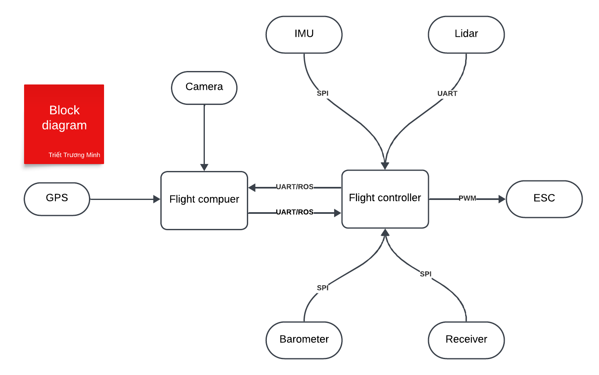
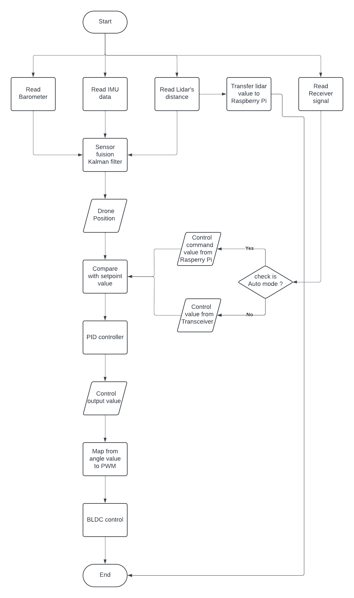

# Autonomous-Drone
This is the Autonomous Drone project using ROS2 to communicate between Raspberry Pi and STM32 to control
# Block Digram 

These are the components that will be use in this project
- IMU using in this project: ICM20948 (this IMU should use with a voltage levels shifter due to 1.8V Vdio)
- LIDAR using in this project: TFmini-S for altitude hold
- Barometer using in this project: BMP280 for altitude measurement 
- Receiver using in this project: NRF24L01 for receive control signal from transmitter 

# Flow charts
## Flow chart for flight controller 

This is the flow chart for the flight controller during flight
- The lidar data can be transfer to flight computer for AI applications
- The lidar is used in flight controller for real-time calculations for drone positioning
